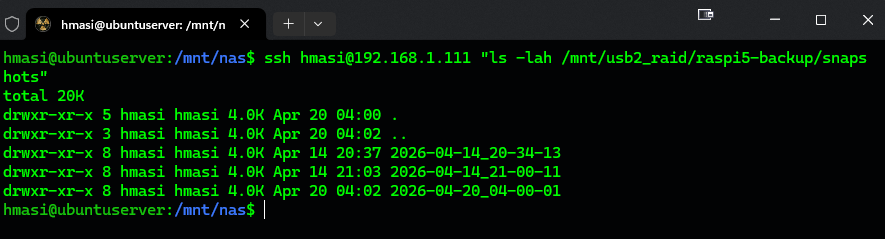

# Case 01 – Automated Backup System (SSH + rsync)

## 🎯 Problem

Raspberry Pi setup had no reliable backup system.

Risks:

* SD card failure
* Data loss from misconfiguration
* No rollback capability

---

## 🧠 Approach

Design a lightweight but reliable backup system:

* `rsync` over SSH
* Snapshot-based backups
* Retention policy (keep last N backups)
* Email notifications

---

## 🔧 Implementation

### Key components

* SSH key-based authentication
* Remote NAS storage
* Timestamped snapshot directories
* `latest` symlink for quick access

---

### Example structure

```text
/mnt/usb2_raid/raspi5-backup/
├── snapshots/
│   ├── 2026-04-14_20-34-13/
│   ├── 2026-04-14_21-00-11/
│   └── ...
└── latest -> snapshots/2026-04-20_04-00-01
```

---

### Backup command (simplified)

```bash
rsync -rltD --delete -e "ssh" /srv/docker/ user@host:/backup/srv-docker/
```

---

## ✅ Validation

* SSH connectivity tested with `BatchMode`
* Backup script executed successfully
* Snapshot directories created
* `latest` symlink updated correctly
* Email notification confirmed

---

## ⚠️ Lessons Learned

* SSH keys must work under `sudo`
* Always test remote commands separately
* Retention logic must be carefully validated
* Logging is critical for debugging failures

---

## 📌 Result

* Fully automated daily backups
* Safe rollback capability
* Minimal system overhead
* Production-ready for home infrastructure

---

## 📸 Example Output




---
