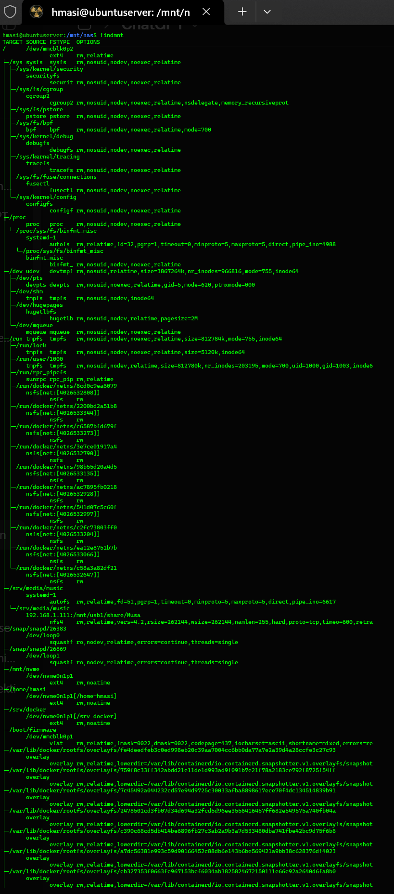
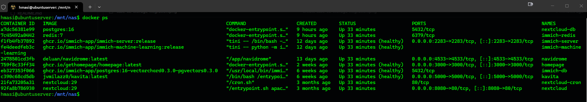
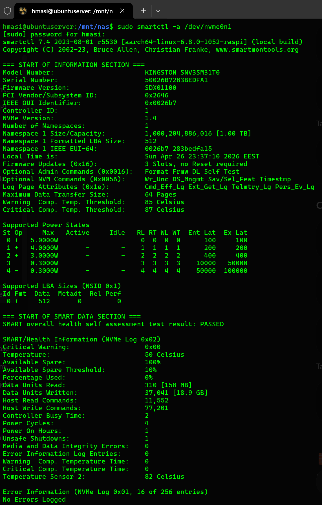

# Case 02 – NVMe Storage Migration (SD → NVMe)

## 🎯 Problem

All data (Docker + user files) was stored on SD card.

Issues:

* Limited lifespan
* Lower performance
* Higher risk of data corruption

---

## 🧠 Goal

* Move all persistent data to NVMe
* Keep OS on SD card
* Avoid downtime and data loss
* Maintain full service functionality

---

## 🧱 Strategy

* Prepare NVMe (partition + ext4)
* Copy data using `rsync`
* Use bind mounts for safe transition
* Validate before making permanent changes

---

## 🔧 Implementation

### 1. Prepare NVMe

```bash
sudo mkfs.ext4 /dev/nvme0n1p1
sudo mount /dev/nvme0n1p1 /mnt/nvme
```

---

### 2. Migrate Docker data

```bash
sudo systemctl stop docker
sudo rsync -aHAX --delete /srv/docker/ /mnt/nvme/srv-docker/
```

Bind mount:

```bash
sudo mount --bind /mnt/nvme/srv-docker /srv/docker
```

Restart:

```bash
sudo systemctl start docker
```

---

### 3. Migrate /home

```bash
sudo rsync -aHAX --delete /home/hmasi/ /mnt/nvme/home-hmasi/
```

Bind mount:

```bash
sudo mount --bind /mnt/nvme/home-hmasi /home/hmasi
```

---

### 4. Persist mounts

`/etc/fstab`:

```fstab
/dev/nvme0n1p1 /mnt/nvme ext4 defaults,noatime,nofail 0 2
/mnt/nvme/srv-docker /srv/docker none bind 0 0
/mnt/nvme/home-hmasi /home/hmasi none bind 0 0
```

---

## ✅ Validation

* `findmnt` confirms NVMe mounts
* Docker containers start successfully
* All services reachable
* SSH keys and user environment intact
* Reboot test successful

---

## 📊 NVMe Health

```bash
sudo smartctl -a /dev/nvme0n1
```

Results:

* Health: PASSED
* Temperature: ~52°C
* Usage: 0%

---

## ⚠️ Lessons Learned

* NVMe form factor matters (2230 vs 2280)
* Always keep rollback directories
* Validate mounts before editing `fstab`
* Test full reboot before cleanup

---

## 📌 Result

* All data moved to NVMe
* Significant performance improvement
* Reduced wear on SD card
* Clean separation of OS and data

---

## 📸 Validation





---

## 🔮 Next Steps

* SMART monitoring + alerts
* Automated health checks
* Storage usage monitoring

---
